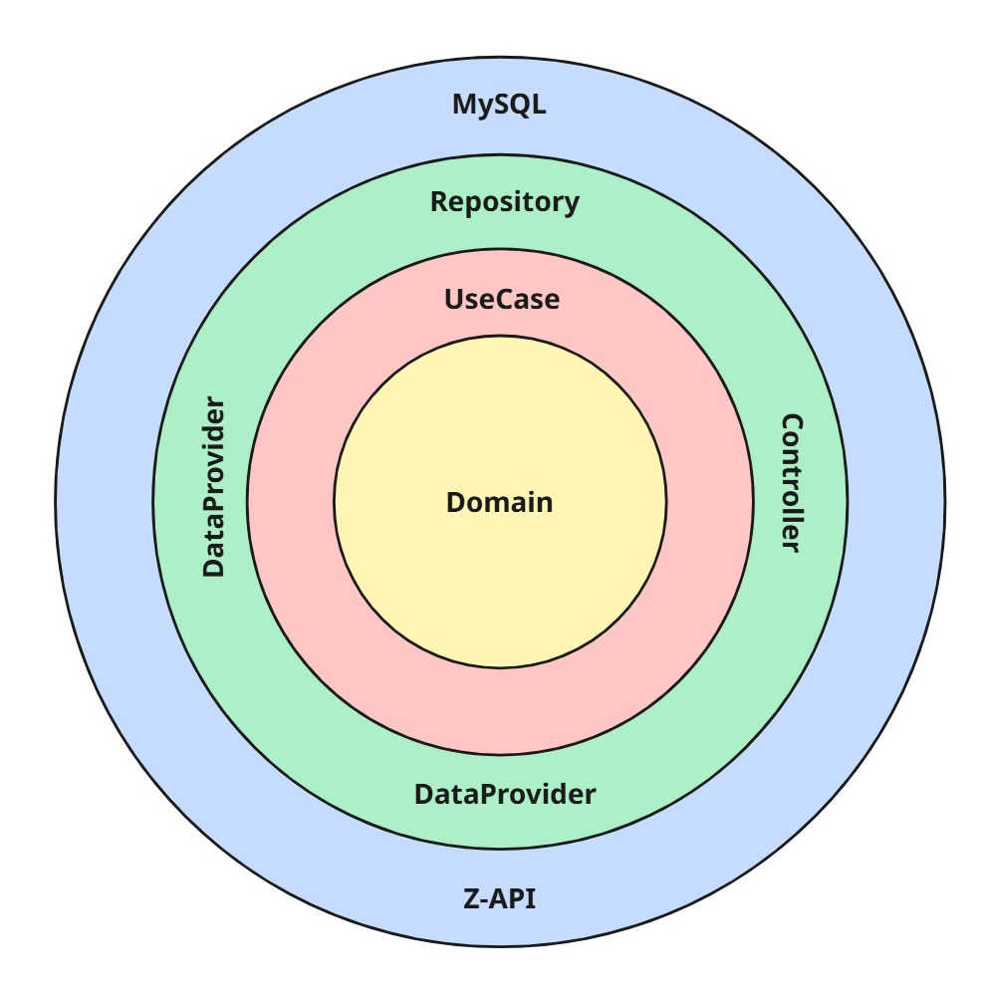

# Cotalizer – API URA

---

> Uma das API REST do LeadFlow: chat com respostas pré-definidas para chat mais simples.
> 

## Sumário

---

## Visão Geral

API responsável pela lógica de chat como URA.

- A partir de respostas pré-definidas extrair dados do usuário
- Qualificação e direcionamento para vendedor

---

## Arquitetura & Domínio

### Estilo arquitetural

- **Clean Architecture** (camadas: EntryPoint → Application → Infrastructure → Domain). O diagrama de camadas está no repositório (veja `docs/arquitetura.jpg`).

**EntryPoint**

- Controllers, DTOs e mappers.

**Application**

- Use cases, gateways (ports), exceções de aplicação.

**Infrastructure**

- Data providers (integrações externas como Z-API), mappers, repositories (MySQL), security.

**Domain**

- Entidades/domínios puros (sem dependências de frameworks).

### Domínios principais

- **Cliente**: Usuário do projeto por completo.
- **Conversa**: Conversa do cliente com a URA.
- **Mensagem**: Mensagem recebida dos usuários do cliente.

> Dica visual rápida:
> 



---

## Infraestrutura

- **Hospedagem**: Render (SaaS) – disponibilidade diária.
- **Persistência**: MySQL
- **Autenticação**: API Key

---

## Tecnologias & Dependências

- **Linguagem/Framework**: Java 21, Spring Boot 3.5 (Web, Validation, Data)
- **Outras**: Lombok, Hibernate Validator, Poi Ooxml

> A lista completa está no pom.xml.
> 

---

## Como Rodar Localmente

**Pré-requisitos**

- Java 17
- Maven 3.9+
- MySQL

**1) Subir dependências com Docker (exemplo)**

```yaml
version: "3.8"

services:
 mysql:
    image: mysql:8.4
    container_name: mysql
    ports:
      - "3306:3306"
    environment:
      MYSQL_ROOT_PASSWORD: root
      MYSQL_DATABASE: appdb
      MYSQL_USER: app
      MYSQL_PASSWORD: app
    command: >
      --default-authentication-plugin=mysql_native_password
      --character-set-server=utf8mb4
      --collation-server=utf8mb4_unicode_ci
    healthcheck:
      test: ["CMD", "mysqladmin", "ping", "-h", "127.0.0.1", "-p${MYSQL_ROOT_PASSWORD}"]
      interval: 5s
      timeout: 5s
      retries: 20
    volumes:
      - mysql_data:/var/lib/mysql

  adminer:
    image: adminer:latest
    container_name: adminer
    ports:
      - "8081:8080"
    depends_on:
      - mysql

volumes:
  mysql_data:
  
```

**3) Run**

```bash
mvn clean spring-boot:run

```

**4) Testes & cobertura**

```bash
mvn -q -DskipTests=false test
open target/site/jacoco/index.html

```

---

## Testes, Qualidade & Segurança

- Não possui testes automatizados

**Autenticação e segurança**

- **Segredos**: 100% via variáveis de ambiente/profiles (dev vs prod).

---

## Observabilidade

- **Logs estruturados** (SLF4J):
    - erros em *data providers* para falhas externas.
    - info nos principais *use cases* (Conversa, ProcessamentoConversa, Mensagem).

---

## API & Contratos

- Integrações externas:
    - Z-API

**Fluxos chave**

- `/mensagens` → recebe a mensagem no padrão Z-API

---

## Licença / Uso

Este repositório é **proprietário** e destinado a uso interno do Cotalizer.

**Não** é liberado para uso, cópia, modificação ou distribuição por terceiros sem autorização expressa.

```
Copyright (c) 2025 Cotalizer.
Todos os direitos reservados.

```
